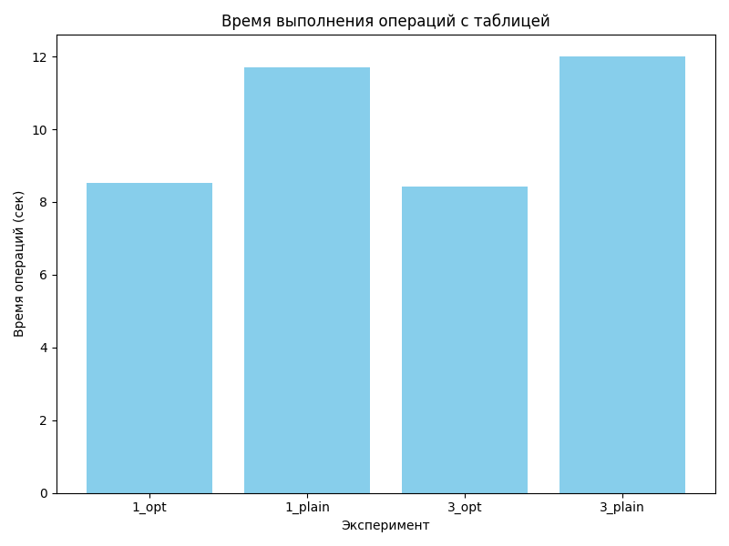
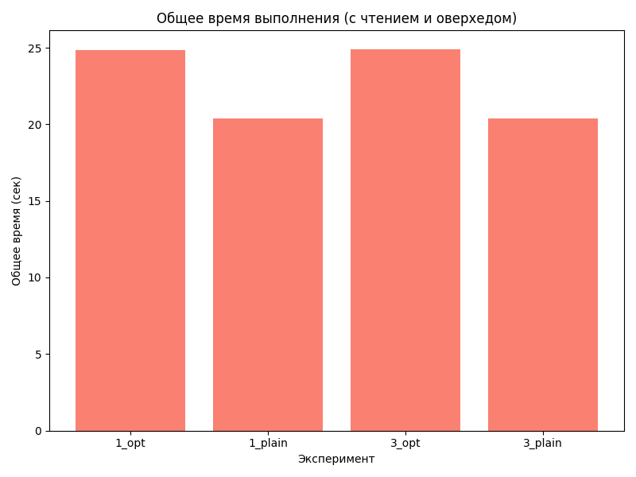
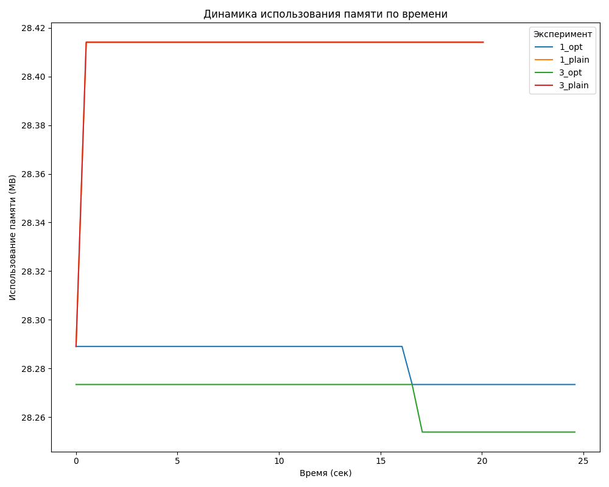
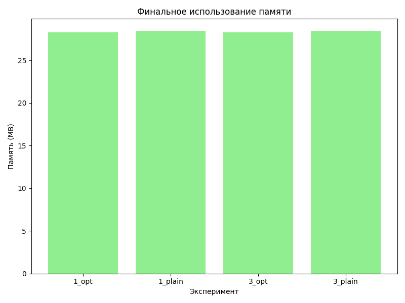

# Lab 2

Aims to measure the execution time and memory usage of a Spark application.

## Experiments

```
python3 -m venv .env
source .env/bin/activate
pip install -r requirements.txt
sh run_experiments.sh
```

## Visualization

```
python3 visualize_results.py
```

## Demonstration of the results

The charts show that optimizations have sped up table operations, although they have added an overhead at the beginning.





